# samlingProsjektNorgesPris
Biblioteker som ble brukt
1- numpy
2- pandas
3- matplotlib.pyplot
4- requests
5- scikit-learn

DEL-1
Jeg hentet datatsett fra https://www.hvakosterstrommen.no/strompris-api
Deretter brukte jeg pandas for å lage en dataframe og oprettet en csv fil som heter strompriser_2022_til_idag, endret seperator og valgte ";" som standard
Jeg sjekket tomme celler
Konverterte "time_start kolonnen til datetime og opprettet to nye kolonner som beregner pris med enhet øre og inkluderer MVA. (navnet er Ører_per_kwh og Ører_per_kwh_inkmva)

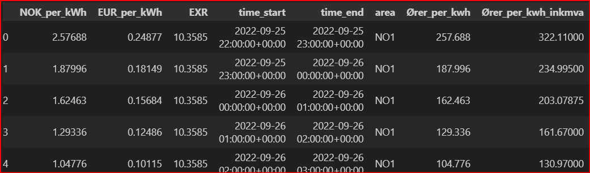

Jeg brukte mean(), median(), std() for å sjekke viktige informasjoner for hvert område.
På denne måten kunne jeg få en innsikt i dataene. Jeg fikk ınformasjon som dyreste område, område som har største pris endringer i 3 år.
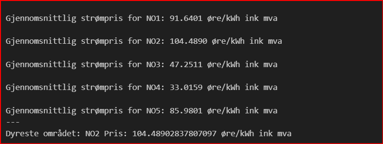
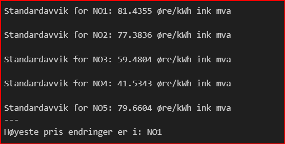

DEL-2

Jeg grupperte dataene og brukte den for å finne gjennomsnitlige daglig pris
Plasserte også norges pris inkludert MVa for å se hvilke områder er over eller under denne prisen i hele periode. Diagrammet viste også noen outliers.
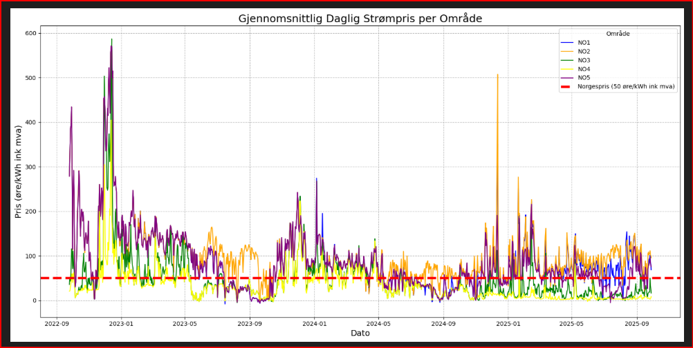

Jeg importerte seaborn og laget en boksplot. Her kan vi se lett at område NO4 er under norgespris hele 3 året.
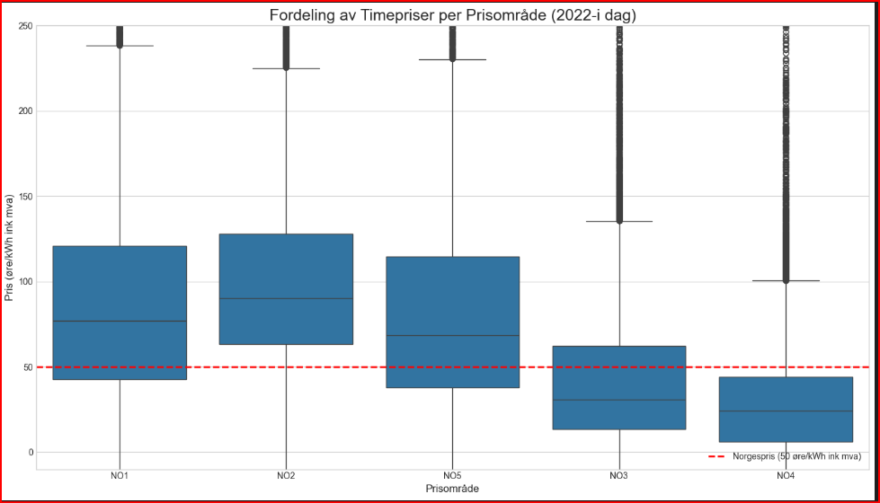

Jeg fant frekvens i Sør-Norge og Nor-Norge i seperat histogram diagramer,
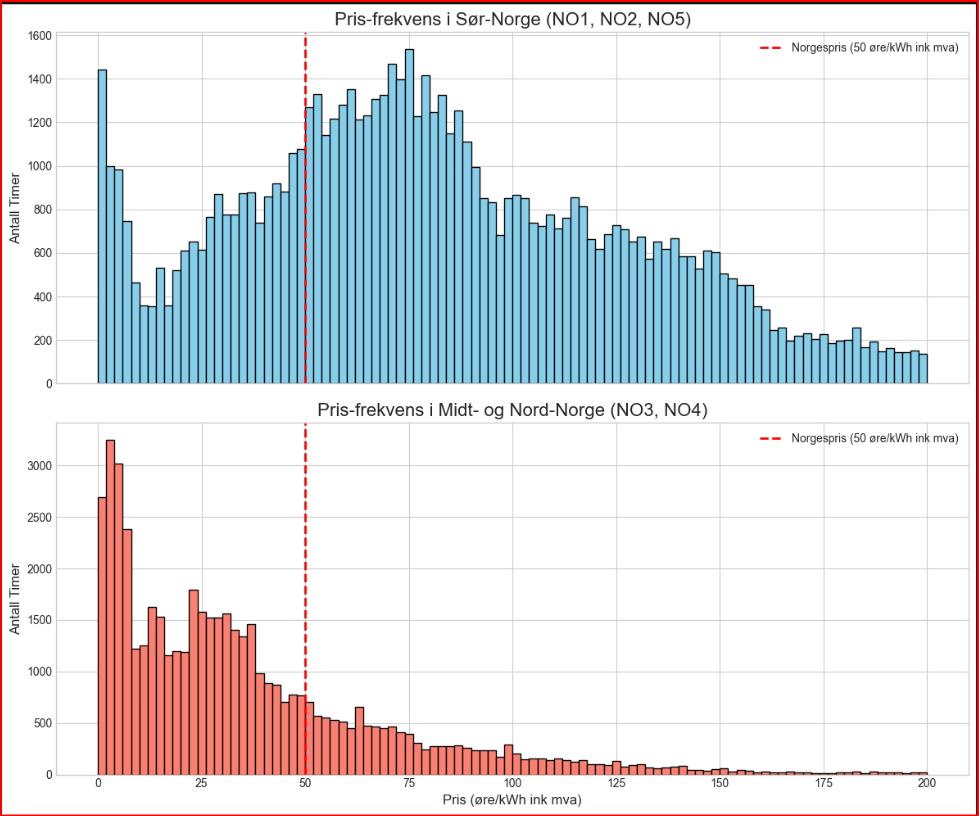

I Midt- og Nord-Norge har nesten alle timene hatt en pris som er betydelig lavere enn 50 øre/kWh.

Jeg laget varmekart for å se gjennomsnitlig timepris i Nor og Sør norge. Slik kan vi se pris endringer i time. Her kan man lett se at i desember blir det mye dyrere
Dette kartet viser oss tydelig to ting:

Døgnmønster: Prisene er jevnt over høyere om morgenen (ca. 07-09) og på ettermiddagen (ca. 16-19).

Årsmønster: Prisene er høyest i de kalde vintermånedene (spesielt desember og lavest om våren/sommeren.)

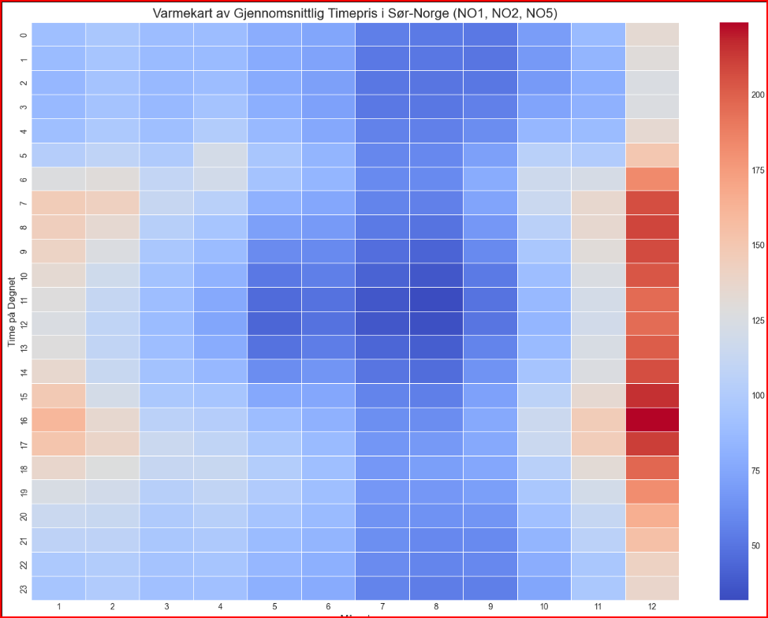
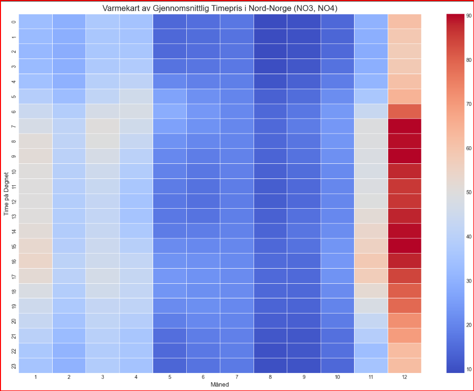

DEL-3

Jeg opprettet 3 funksjoner 

finn_pris_område(postnummer) som returnerer område

hent_dagens_priser(område) som henter dataframe fra url og returnerer en dataframe

vis_dagen_priser_for_postnummer() som bruker de to første funksjonene og printer

jeg skrev ny kode for å lagre dataframe og ny csv som tar alltid siste 3 års dataer.

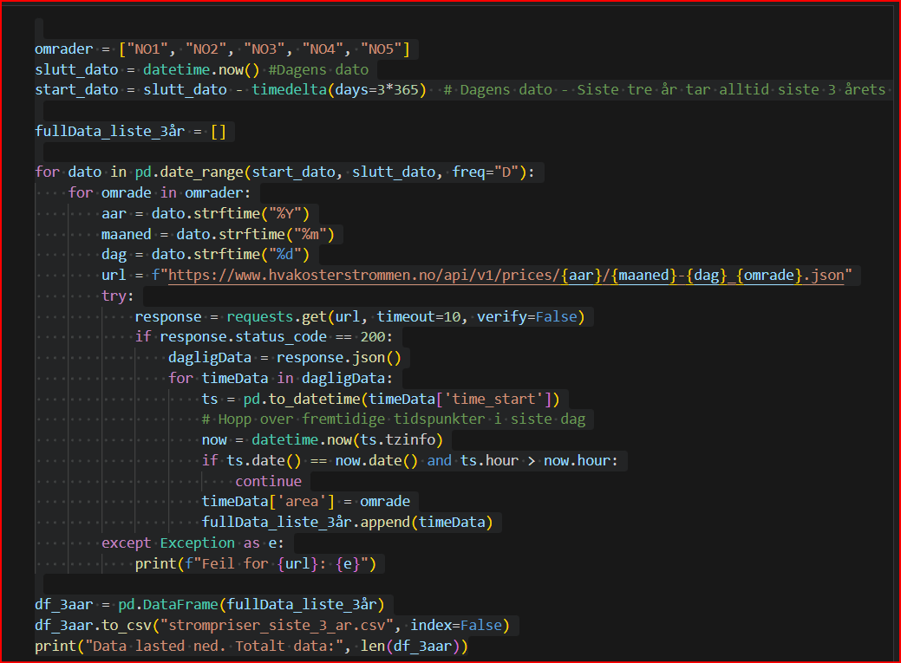

Jeg lagrer dataframe igjen med navnet df_3aar
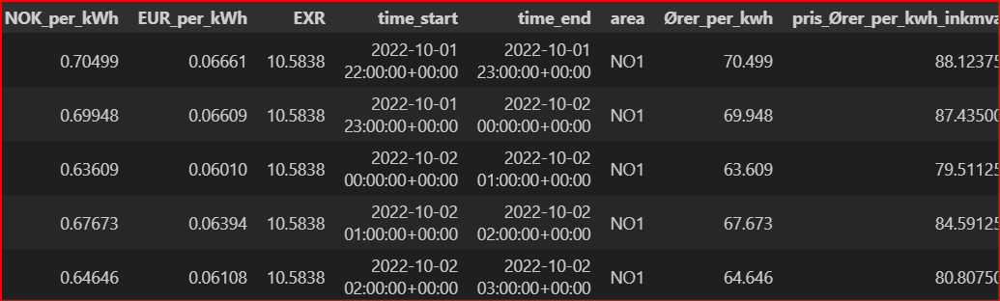 

Jeg lagret en ny funksjon som het historisk_snitt_pris_omraade()

Den tar postnummer fra brukeren og ved hjelp av finn_pris_område funksjonen finner riktig område. Deretter beregner snittpris for området og printer det ut ink mva. (Jeg brukte 3045 for denne output)
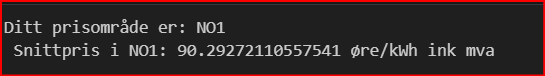

Jeg laget hent_snittpris_per_time() funksjonen og printer snittprisene, tegner histogram for området brukeren velger. Man kan se fra diagramet at prisene i NO1 er dyrest på kl 17. (Høyere mellom 6-9 og 15-19) Snittpris i dette området er alltid høyere enn norgespris

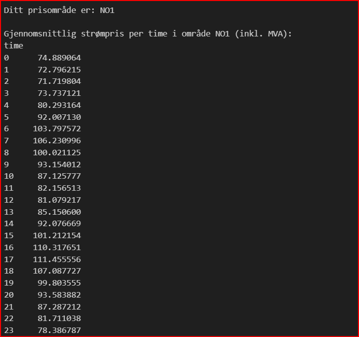
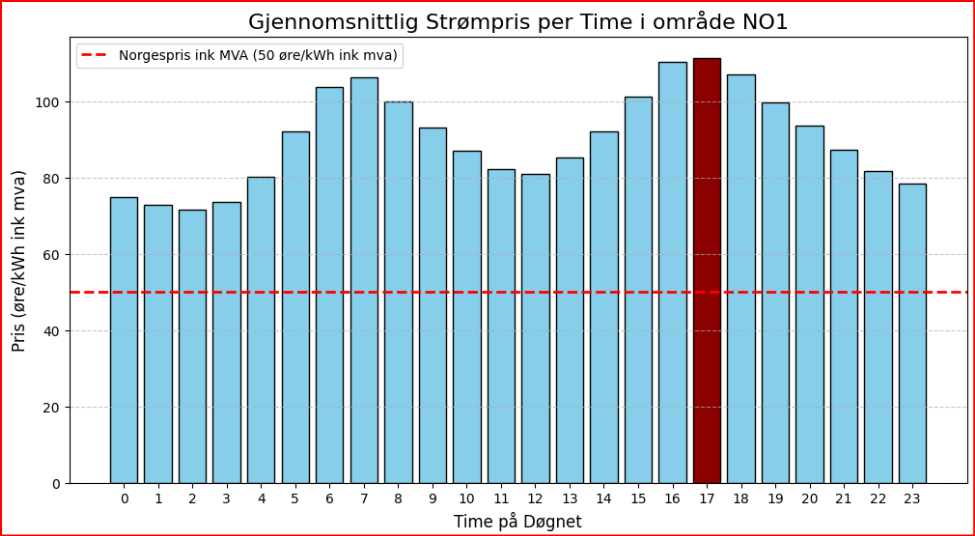

DEL-4

Jeg opprette tførst en dataframe som het df_manedlig som viser gjennomsnitlig pris for hver måned i perioden. Jeg brukte denne dataframen for å prediktere. Jeg brukte lineær regresjon. Prediksjon model fungerte ikke som jeg forventet, som ble synlig i diagramet etter 35 måneder blir det drastisk fall. Da bestemte jeg å fjerne dataer som kan bli outliers. Jeg brukte z score for å bestemme outliers. LAgret ny dataframe som het df_3aar_renset. Model tar et tall som definerer antall mnd i fremtid for å prediktere. 

Denne prediksjonen ble gjort med enkelt lineær regresjon uten at model ble trent. Derfor blir prediksjonen ikke som forventet. Egentlig burde den være høyere enn forrige måned. I vinteren forventes det at strømprisen øker.

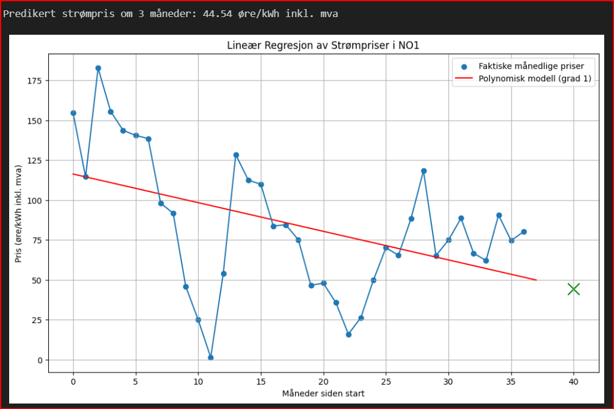

Jeg brukte en annen modell og trent det. Brukte lineær regression for siste 100 dagene. Denne prediksjonen viser at for NO1 prisene er høyere enn Norgespris. Prediksjon er også høyere for imorgen.

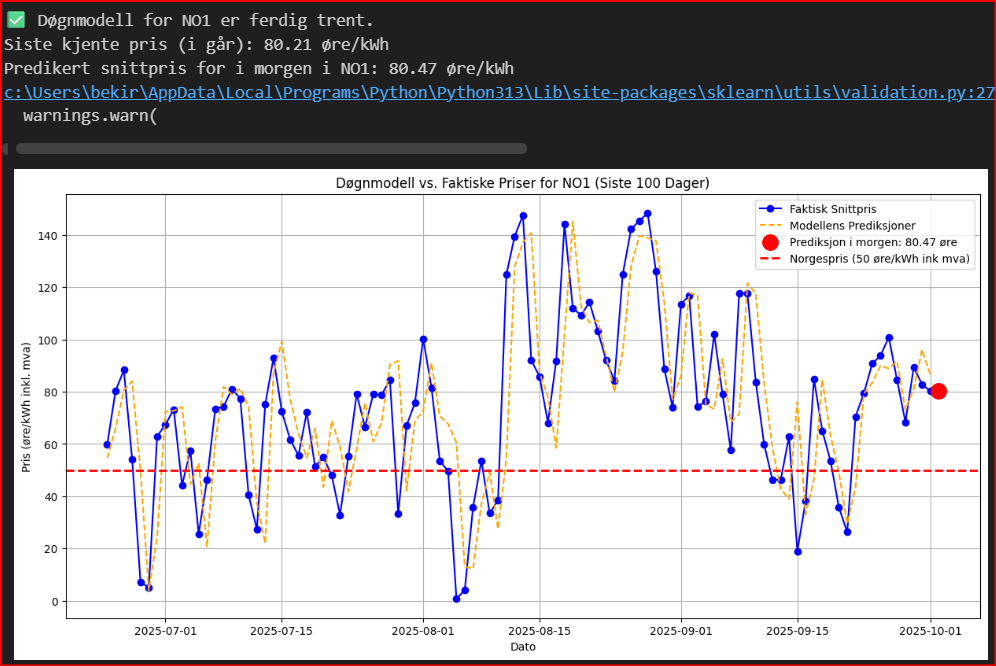

DEL-5 

Her brukte jeg vektet snittpris for å finne en riktig resultat. 

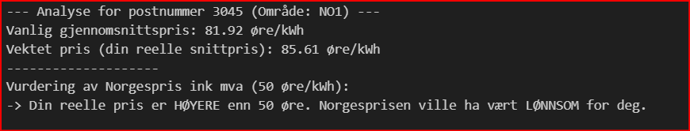

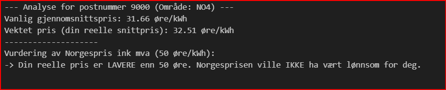

